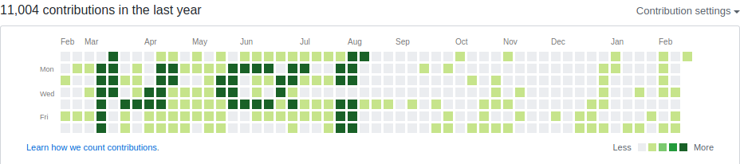

## result 

**issue with upside down **



## pattern

```
..9...................99...........................
..9...................99...........................
..9...................99...........................
..9.999......9999.9...99...........................
..99..99....99...9.................................
..99...99...99...99...99...........................
..99...99....9999.99..99...........................
```

## code

```python
#!/usr/bin/env python3
import  os
import time
import datetime

coef = 20
username = "iamvee"
repo = "mahmood"


pattern = """
..9...................99...........................
..9...................99...........................
..9...................99...........................
..9.999......9999.9...99...........................
..99..99....99...9.................................
..99...99...99...99...99...........................
..99...99....9999.99..99...........................
"""
os.system("git init")


lines = pattern.replace('.', '0').split('\n')
arr = [[int(c) for c in line] for line in lines if line]

a, b = len(arr), len(arr[0])
arrx = [[arr[i][j] for i in range(a)] for j in range(b)]
arrx = arrx[::-1]

now = time.time()
weekday = datetime.datetime.now().weekday()

for i, x in enumerate(arrx):
    for j, y in enumerate(x):
        for yy in range(coef * y):
            tx = now -  24*3600 * (i*7-j+weekday) - yy
            os.system(f"echo {tx} >> file")
            os.system(f"""
git add .
git commit -m "test $i"
GIT_COMMITTER_DATE="`date --date=@{tx}`"
git commit --amend --no-edit --date "`date --date=@{tx}`"
""")
            

os.system(f"""
git remote add origin git@github.com:{username}/{repo}.git
git push -u origin master
""")    

```

## usage

1. create your pattern
2. set your username and empty repository name on github. also you can set a `coef` to generate more commits.
3. save python code in a file (say `pattern.py`)
4. change file's access rights

```shell
chmod +x ./pattern.py
```

5. run it

```shell
./pattern.py
```